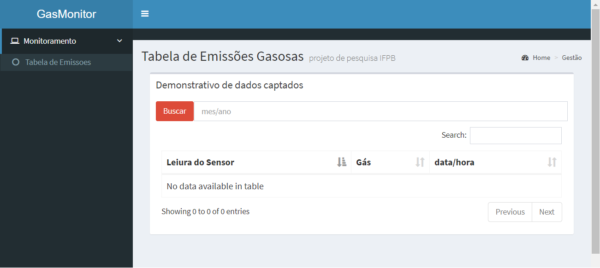

O monitor.rar corresponde aos códigos da interface gráfica do monitoramento de gás a partir de dados coletados por sensores via rede wifi.
O monitorGas permite a visualização em tempo real de valores captados pelos sensores de gás, demonstrando de maneira eficaz a emissão gasosa de uma fonte. 

