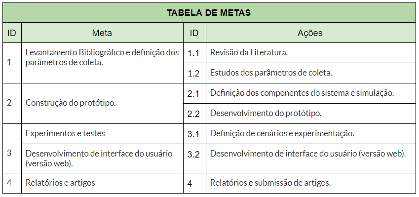
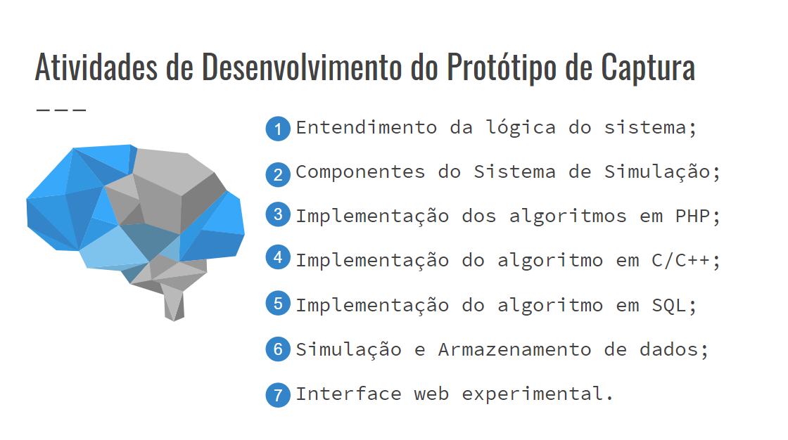
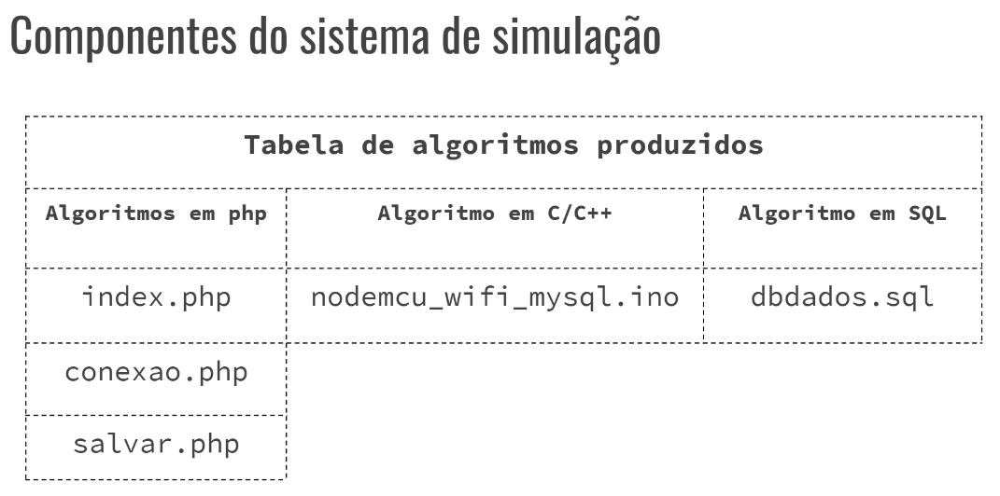

# PIBIT-Monitoramento-de-Gas
- Repositório de Arquivos do projeto de iniciação de pesquisa tecnológica do IFPB intitulado de: Um Sistema Embarcado para sensoriamento de emissões gasosas de resíduos sólidos orgânicos.

- Os arquivos correspondem aos documentos e algorítimos gerados a partir da conclusão das metas do projeto de pesquisa.

